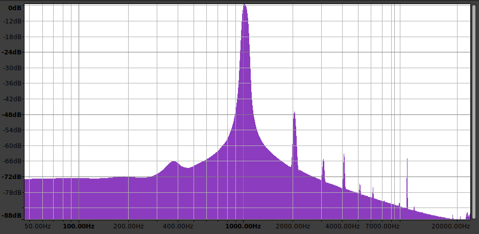

# USB Audio Interface

This repo (will) contain firmware, schematics, and instructions for creating a functional audio interface usable cross-platform over USB. The current design supports one balanced XLR input with 80dB gain, and a 1/4 inch input with 40dB gain.

This design was created for the course CSE 145: Embedded Systems Design Project at UCSD in Spring 2022.

## Electrical

Inside the [audio_interface](audio_interface) subfolder, there is a KiCAD project with both the schematic and layout for the custom PCB. For easier viewing, the [schematic](docs/audio_interface.pdf) and [layout](docs/audio_layout.pdf) are exported as pdfs as well. Note that many of the component choices were made due to the specific availability during the silicon shortage in Spring 2022. Other substitutes may be cheaper or easier to obtain in the future. To see the total list of necessary components, as well as what is currently in stock, check out the [Octopart BOM](https://octopart.com/bom-tool/Pp2dbWVm).

There is a [test log](https://docs.google.com/document/d/14NlvdZo9BEKJ16lZTaRw5GM3TA98BqlqD3HZuE-fhHs/edit?usp=sharing) which documents all the of the properties of the design, comparing the measured vs expected values. In addition, a listing at the bottom functions as a notebook to record which rework was performed on which day, and other observations.

## Audio Quality
There is a short recording demonstrating both inputs in the [docs](docs) directory. In addition, below is a frequency plot showing the results from recording a generated 1kHz sine wave on the instrument input. Currently the noise floor is low, but there is some distortion which can hopefully be resolved with further board modifications.

## Contributors

Many colleagues contributed to this project, and it could not have worked without their help with these sections:

- Ravi Johnson - electrical design reviews, assembly
- Devanshi Jain - electrical testing
- Seeraj Somla - systems engineering
- Nathan Hui, Christopher Crutchfield - advising